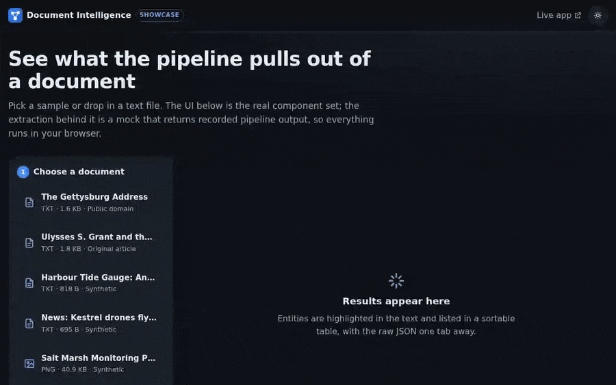
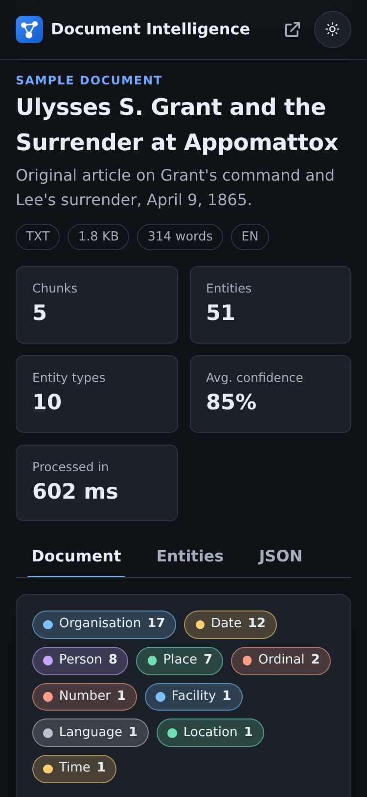
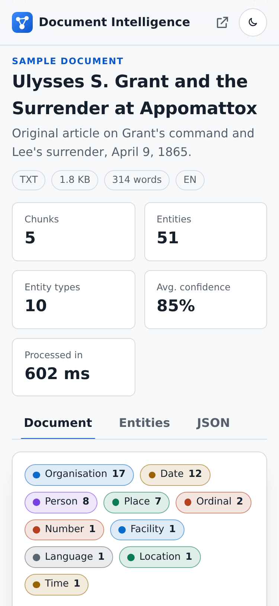
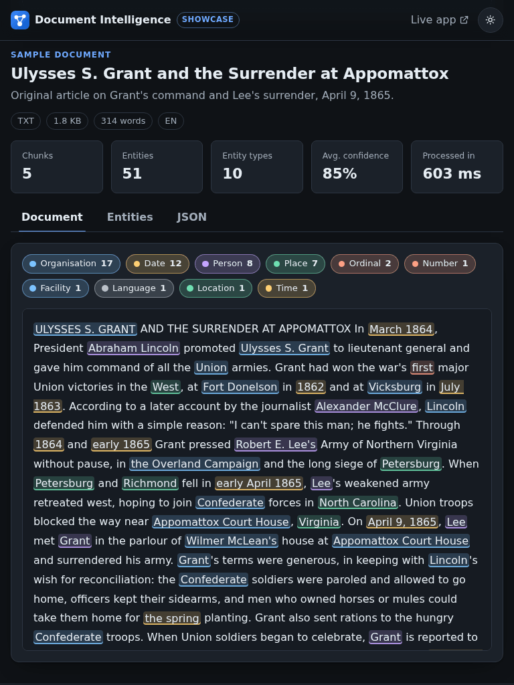
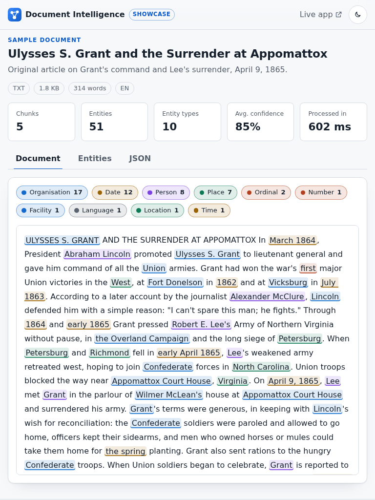
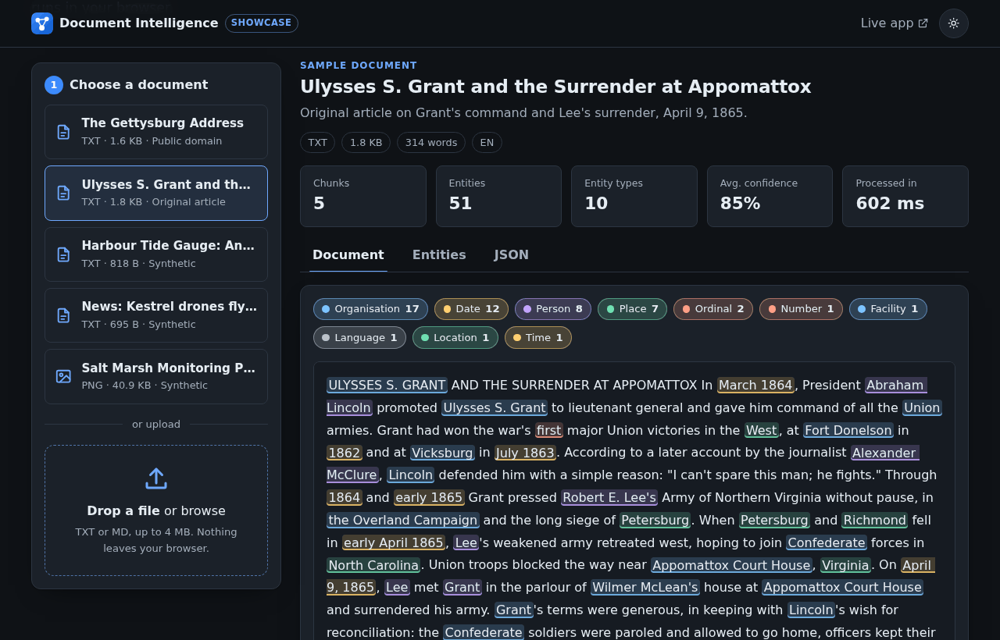
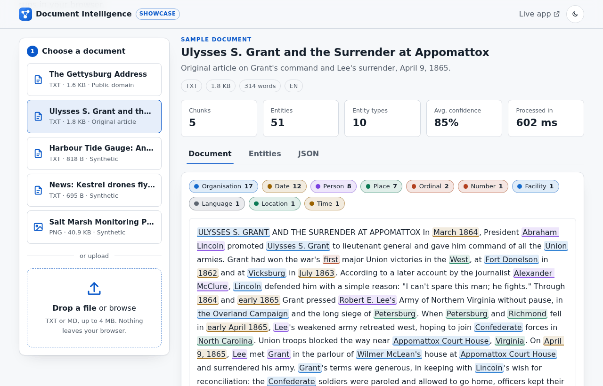
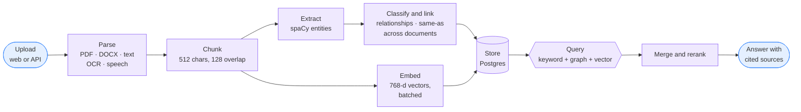
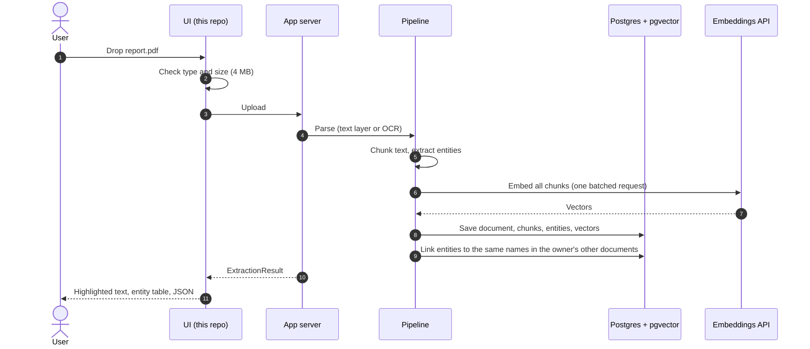
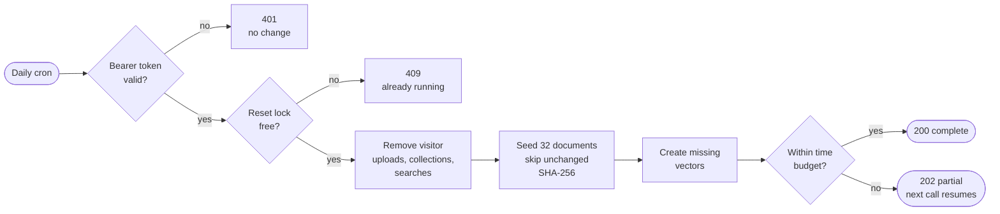

<a id="readme-top"></a>

<div align="center">

<picture>
  <source media="(prefers-color-scheme: dark)" srcset="assets/hero-dark.svg">
  <source media="(prefers-color-scheme: light)" srcset="assets/hero-light.svg">
  
</picture>

[](https://github.com/DeAtHfIrE26/document-intelligence-showcase/actions/workflows/ci.yml)
[](LICENSE)
[](tests)
[](#engineering-highlights)
[](#engineering-highlights)
[](tsconfig.json)
[](https://document-intelligence-framework.vercel.app)

**Upload a PDF, a scan or a note and get back people, places, dates and organisations, linked into a knowledge graph you can search, with answers that cite their sources.**

[**Live Demo**](https://document-intelligence-framework.vercel.app) ·
[**Docs**](docs/COMPONENTS.md) ·
[**Report Bug**](https://github.com/DeAtHfIrE26/document-intelligence-showcase/issues/new?template=bug_report.yml) ·
[**Request Feature**](https://github.com/DeAtHfIrE26/document-intelligence-showcase/issues/new?template=feature_request.yml)

</div>

---

This repository is the **open part** of the Document Intelligence Framework: the
UI components, their tests, and a playground that runs them end to end. The
extraction pipeline behind the [live app](https://document-intelligence-framework.vercel.app)
is private; here it is replaced by a mock that returns **recorded output from
the real pipeline**, behind the same interface. [Why?](#whats-open-and-whats-private)

<details>
<summary><strong>Table of contents</strong></summary>

- [Demo](#demo)
- [Features](#features)
- [Supported documents](#supported-documents)
- [Quick start](#quick-start)
- [Tech stack](#tech-stack)
- [Project structure](#project-structure)
- [Architecture](#architecture)
- [What's open and what's private](#whats-open-and-whats-private)
- [Engineering highlights](#engineering-highlights)
- [Case studies](#case-studies)
- [Roadmap](#roadmap)
- [Contributing](#contributing)
- [License](#license)
- [Author](#author)

</details>

## Demo

<div align="center">
  
  <p><sub>30-second walkthrough of the playground: sample → processing → highlighted entities → table → JSON → your own upload.</sub></p>
</div>

<details>
<summary><strong>Screenshots: light and dark at 375, 768 and 1280 px</strong></summary>

| | Dark | Light |
|---|---|---|
| **Mobile** (375 px) |  |  |
| **Tablet** (768 px) |  |  |
| **Desktop** (1280 px) |  |  |

</details>

<p align="right"><a href="#readme-top">↑ back to top</a></p>

## Features

| | Feature | Details |
|:---:|---|---|
|  | **Drop, click or keyboard upload** | One control for drag-and-drop, the file picker and Enter/Space, with a size check before anything is sent. |
|  | **Every common format** | PDF, Word, text and Markdown, scanned images (OCR), and audio (speech to text) in the full pipeline. |
|  | **Entity highlighting** | People, organisations, places, dates and amounts marked in the text, colour-coded, with a legend that filters. |
|  | **Results you can work with** | Sortable, searchable entity table; click a row to jump to it in the text; raw JSON one tab away. |
|  | **Knowledge graph and hybrid search** | In the live app: entities link across documents, and search combines keywords, the graph and vectors, with cited AI answers. |
|  | **Accessible by default** | Keyboard-only use, live announcements for each processing stage, WAI-ARIA tabs, `aria-sort`, reduced-motion support, 0 axe violations. |
|  | **Safe rendering** | Document text never goes through `innerHTML` (enforced by lint, covered by an XSS test). Nothing leaves the browser in the playground. |
|  | **Small and fast** | No framework: 13 KB of JS and 4 KB of CSS gzipped; Lighthouse 100 in every category on mobile and desktop. |

## Supported documents

| Type | Extensions | Full pipeline (live app) | This playground |
|---|---|---|---|
| PDF | `.pdf` | Text layer, with OCR fallback for scans | Sample output |
| Word | `.docx`, `.doc` | Paragraph text | Sample output |
| Text and Markdown | `.txt`, `.md` | ✔ | **Upload your own** (rule-based mock) |
| Images | `.png`, `.jpg`, `.tiff`, … | OCR (Tesseract), vision-model fallback | Sample output (OCR'd poster) |
| Audio | `.mp3`, `.wav`, `.flac`, … | Speech to text | — |

The five samples in [`samples/`](samples) are public domain (the Gettysburg
Address, 1863), an original article based on the historical record, or
synthetic documents about invented people and places.

## Quick start

```bash
git clone https://github.com/DeAtHfIrE26/document-intelligence-showcase.git
cd document-intelligence-showcase
npm ci
npm run dev          # playground at http://localhost:5173
```

```bash
npm run check        # lint + typecheck + tests + production build (what CI runs)
npm run coverage     # tests with a coverage report
```

Requires Node 20+ (`.nvmrc` pins 22). No environment variables and no network
calls are needed; `.env.example` lists the one optional setting.

Open a sample straight away with `?sample=gettysburg-address`, and force a
theme with `?theme=light` or `?theme=dark`.

<p align="right"><a href="#readme-top">↑ back to top</a></p>

## Tech stack

**This repository:**


**The live app:**


## Project structure

```text
document-intelligence-showcase/
├── index.html                  # playground shell and icon sprite
├── src/
│   ├── types.ts                # ExtractionResult / Extractor contract
│   ├── main.ts                 # playground wiring and state
│   ├── components/             # dropzone, processing, viewer, table, filter, tabs
│   ├── extractor/              # mock extractor, rule-based heuristics, recorded fixtures
│   ├── fixtures/               # real pipeline output for the five samples (JSON)
│   ├── lib/                    # highlight, format, file types, a11y, theme, dom
│   └── styles/                 # design tokens (light + dark) and component styles
├── tests/                      # Vitest + jsdom: 49 tests
├── samples/                    # the five sample documents
├── assets/                     # README banner, demo GIF, screenshots, icons
├── docs/COMPONENTS.md          # component and contract reference
├── scripts/build-hero.py       # generates the animated README banners
└── .github/                    # CI, issue and PR templates
```

<p align="right"><a href="#readme-top">↑ back to top</a></p>

## Architecture

### The pipeline



<sub>Blue: the interface in this repository. Purple: the private pipeline.</sub>

### One document's journey



### Demo reset (daily cron)



Every write is scoped to the demo account, and each document's owner is
checked before it is deleted, so a reset can never touch a real user's data.
The lock is a database row that expires after 15 minutes, so a run that
dies halfway can't block the next one.

### What's open and what's private

| Open (this repository) | Private (the live app) | Why private |
|---|---|---|
| UI components, design tokens, a11y helpers | Parsing, OCR, chunking and entity pipeline | Core product logic |
| The `ExtractionResult` contract | Prompts, reranking and scoring | Hard-won tuning; easy to copy |
| Mock extractor + recorded outputs | Retrieval (keyword, graph, vector) and DB schema | Couples to infrastructure and data |
| Tests for everything above | Auth, access control, rate limits, `/internal` jobs | Security-sensitive |
| Five public-domain / synthetic samples | Production data, deployment config, secrets | Never public |

The mock keeps the same interface, so the components here run unchanged
against the real service.

<p align="right"><a href="#readme-top">↑ back to top</a></p>

## Engineering highlights

All numbers were measured, not estimated. Back-end timings used a stubbed AI
API with fixed latencies (250 ms per embedding request, 1.5 s per chat call)
and a 21 KB test document; "live" numbers come from a smoke test against
production. Details are in the private repository's change log.

<details open>
<summary><strong>Performance and query counts</strong></summary>

| Metric | Before | After |
|---|---:|---:|
| Upload and process a 21 KB document | 230 s | **2.9 s** |
| Embedding API requests per upload | 855 | **2** |
| SQL statements per upload | 15,084 | **29** |
| First search | 5.0 s | **2.05 s** |
| Repeated identical search | 4.8 s | **0.05 s** |
| SQL statements per search | 68 | **49** |
| Keyword lookup across 100,000 chunks | 167 ms | **0.2 ms** |
| App cold start (time / memory) | 2.3 s / 254 MB | **1.35 s / 158 MB** |
| **Live:** logged-in page loads | 1.2–2.7 s | **0.26–0.45 s** |
| **Live:** search | 15.7 s | **0.33 s** |
| **Live:** upload and processing | 15.8 s | **6.4 s** |
| **Live:** database round trip | 225 ms | **1–2 ms** |

</details>

<details>
<summary><strong>Size, tests, release hygiene and accessibility</strong></summary>

| Area | Before | After |
|---|---:|---:|
| Vector index dependency (FAISS → pgvector), installed size | 122 MB | **196 KB** |
| Motion layer: CSS instead of an animation library | 28–49 KB gz (GSAP / Motion) | **4.3 KB gz** (whole stylesheet) |
| This playground: JS / CSS, gzipped | — | **13 KB / 4 KB** |
| App test suite (pytest) | 0 | **48** |
| Showcase tests (Vitest) / line coverage | — | **49 / 94.6%** |
| Committed secrets, full history (gitleaks, 60 commits) | — | **0** |
| Client-side XSS sinks (`innerHTML` with document data) | 22 | **0** |
| Cross-user leaks in graph traversal | present | **fixed** |
| axe-core WCAG 2 A/AA violations: app (9 pages) | not audited | **0** |
| axe-core violations: playground (16 views, both themes) | — | **0** |
| Lighthouse, playground (perf · a11y · best practices · SEO) | 86 · 100 · 100 · 92 | **100 · 100 · 100 · 100** (mobile and desktop) |
| Cumulative layout shift, playground (mobile) | 0.271 | **0** |

One honest regression: the app's mobile Largest Contentful Paint went from
428–480 ms to 520–540 ms, because entrance animations fade content in. It
stays far under the 2.5 s budget and was kept deliberately.

</details>

<p align="right"><a href="#readme-top">↑ back to top</a></p>

## Case studies

<details>
<summary><strong>1. The upload that never finished (230 s → 2.9 s)</strong></summary>

**Symptom:** uploads of anything but tiny files hung until the hosting platform
killed the request.

**Cause:** three problems stacked up. The chunker could loop forever at the
end of the text, because its next start position didn't always move forward.
Every chunk and every entity was embedded in its own API request: 855
requests for a 21 KB file. And each relationship was written with its own
SELECT and COMMIT: 15,084 SQL statements.

**Fix:** the chunker always advances. Embeddings are batched (up to 256
inputs or 400k characters per request), and relationships are written in one
batch. Per-entity embeddings existed only to feed a similarity step that had
never produced a result, so they were removed. **855 → 2 requests, 15,084 → 29
statements, 230 s → 2.9 s.**

</details>

<details>
<summary><strong>2. Vector search that silently returned nothing</strong></summary>

**Symptom:** hybrid search "worked", but only keyword and graph results ever
appeared.

**Cause:** the vector lookup built a new, empty index on every call and so
always returned nothing. The index also lived on the instance's temporary
disk, so it would have been lost on every deploy anyway.

**Fix:** vectors moved into Postgres with pgvector and an HNSW cosine index.
Search is one `ORDER BY embedding <=> query LIMIT k` query that survives
restarts and is shared by every instance. Once vectors came back, two
relevance bugs surfaced and were fixed: stopwords such as "the" outranked
real matches, and punctuation stopped "Berlin?" from matching "Berlin".

</details>

<details>
<summary><strong>3. 225 ms per query: the region mismatch (search 15.7 s → 0.33 s)</strong></summary>

**Symptom:** in production, every page took 1–3 s and a search took 15.7 s,
while the same build was fast locally.

**Cause:** the app's startup now logs the database round trip, and it read
**225 ms**. The function ran in Washington, D.C., and the database in
Singapore. A search makes dozens of queries, so the delay multiplied.

**Fix:** the function was pinned to the database's region. The round trip
dropped to 1–2 ms: **pages 1.2–2.7 s → 0.26–0.45 s, search 15.7 s → 0.33 s.**
A second fix removed 15 s of retries when the AI provider's account was out
of credit: account errors now pause calls for five minutes, and search falls
back to keyword and graph results immediately.

</details>

<p align="right"><a href="#readme-top">↑ back to top</a></p>

## Roadmap

See [ROADMAP.md](ROADMAP.md). Good first issues include keyboard navigation
between highlights, CSV export of the entity table, and a confidence
threshold slider.

## Contributing

Contributions are welcome. See [CONTRIBUTING.md](CONTRIBUTING.md). In short:
`npm run check` must pass, new behaviour needs tests, controls must work from
the keyboard, and samples must be public domain or synthetic. Please follow
the [Code of Conduct](CODE_OF_CONDUCT.md), and report vulnerabilities
privately as described in [SECURITY.md](SECURITY.md).

## License

[MIT](LICENSE) © 2026 Kashyap Patel. Sample documents: see
[samples/README.md](samples/README.md).

## Author

**Kashyap Patel**: full-stack engineer working across .NET, React, Python
and cloud, with a focus on fast, well-crafted systems.

[Portfolio](https://kashyappatel.vercel.app) ·
[GitHub](https://github.com/DeAtHfIrE26) ·
[LinkedIn](https://linkedin.com/in/kashyap-patel2673) ·
[Email](mailto:kashyappatel2673@gmail.com)

<p align="right"><a href="#readme-top">↑ back to top</a></p>
